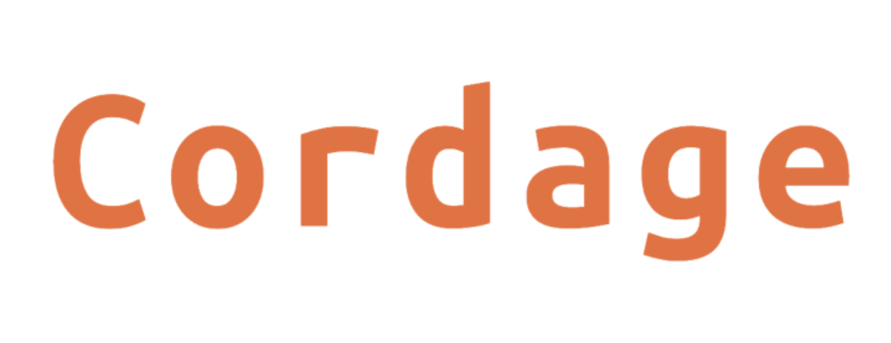
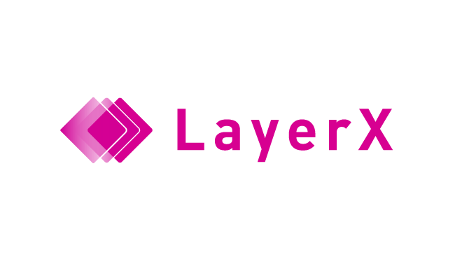

# Cordage

  

Cordage makes the interoperability possible between [Corda](https://www.corda.net/) and other Blockchains
by providing several modules that propagate, pull and verify information between Blockchains
without any trusted third party.

In the first stage, we focus on EVM based blockchain such as Ethereum and [Quorum](https://www.goquorum.com/).

WARNING: Cordage is alpha quality software, improvements and fixes are made frequently.

## How Cordage makes the interoperability possible
In general, key features to compose the interoperability are as follow:

- Data propagation
- Data verification

Data propagation is a feature that propagates data to each other between blockchains.
Data verification is a feature that verifies propagated data.

Cordage provides these features as executable modules
that does not require additional components except Corda and the other Blockchain.
A combination of these modules enables you to build concrete cross-chain applications.

## Cordage use cases
Put simply, cross-chain applications are abstracted in 2 patterns.

One is the data import.
Implementing the wrapped asset such as Wrapped Bitcoin enables you to move assets from one ledger to the other.
By implementing the cross-chain oracle, you can import external ledger information such as ETH/DAI price.

The other one is the data update with condition triggers.
The cross-chain atomic swap is one of the most appealing applications.
It enables payment-versus-payment and payment-versus-delivery settlement.
This pattern also includes asset encumbrance.
It realizes various applications such as liens, collateral in finance, clawbacks, etc.

## Cordage modules
In the first stage, we focus on Corda and EVM based blockchain interoperability,
especially, Ethereum PoW and Quorum IBFT.

In this combination, data propagation and data verification features are consists of subdivided features as follow:

Data propagation
- P1: Feature to create and send Ethereum Tx from Corda
- P2: Feature to execute Corda Flow from Ethereum (probably not needed)
- P3: Feature to import Tx / Event finalized in Ethereum into Corda
- P4: Feature to import Tx finalized in Corda into Ethereum

Data verification
- V1: Feature to verify Ethereum Tx, Event and Block imported at P3 and to verify finality of Block
- V2: Feature to verify Tx value imported at P4 and to verify finality of Corda Tx

### Implementation status
We have implemented the following modules so far.

P1: [Flow Ethereum TX](./flow-ethereum-tx)
- This CorDapp provides a simple example of how to send a transaction to Ethereum from Corda Flow.

P3: [Flow Ethereum Event Watch](./flow-ethereum-event-watch)
- This CorDapp provides a simple example of how to watch (retrieve) Ethereum Events from Corda Flow.

### How to run
Please follow the README.md in each directory.

## Contact
For further discussions and questions, please talk to us on [Gitter](https://gitter.im/LayerXcom/Cordage)!

## Contributing
We welcome contributions to Cordage.
Feel free to submit your own issues and PRs!

## License
Cordage is licensed under [the Apache License, Version 2.0](./LICENSE).

## Maintainers
- [shun-tak](https://github.com/shun-tak)
- [etaroid](https://github.com/etaroid)
- [yudetamago](https://github.com/yudetamago)

## Sponsors
 
