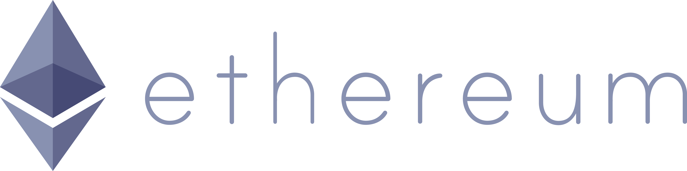

# Custom Notary Flow
<p align="center">
  
</p>

<p align="center">
  
</p>

This CorDapp provides ...


## Pre-requisites:
  
See https://docs.corda.net/getting-set-up.html.


## Usage

### Running the database:
```
docker run --name postgres96 -e POSTGRES_PASSWORD=password -p 5432:5432 -d postgres:9.6
```

### Running the nodes:

See https://docs.corda.net/tutorial-cordapp.html#running-the-example-cordapp.

Use the `deployNodes` task and `./build/nodes/runnodes` script.

### Interacting with the nodes:

You'll be interacting with the node via its interactive shell.

Run MakeAgreementFlow from PartyA:
```
flow start jp.co.layerx.cordage.customnotaryflow.flows.MakeAgreementFlow target: "O=ParticipantB,L=Tokyo,C=JP", agreementBody: "RESIDENTIAL LEASE AGREEMENT"
```

Run this from both PartyA and PartyB:
```
run vaultQuery contractStateType: jp.co.layerx.cordage.customnotaryflow.states.Agreement
```

Run TerminateAgreementFlow from PartyA:
```
flow start jp.co.layerx.cordage.customnotaryflow.flows.TerminateAgreementFlow linearId: "661504cb-ba74-4bd5-9b93-940201ca7a11"
```
