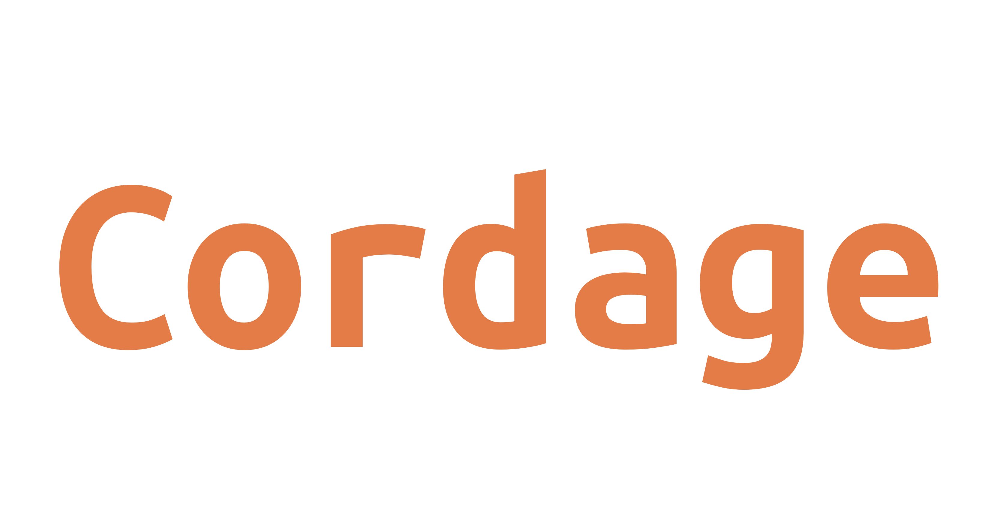

# Cordage logo information

## Font color
 `#FF6633`

## Font style
[Ubuntu Mono Bold](https://design.ubuntu.com/font/)

### Font copyright
Copyright 2010,2011 Canonical Ltd.

This Font Software is licensed under the Ubuntu Font Licence, Version
1.0.  https://launchpad.net/ubuntu-font-licence

### Font trademarks
Ubuntu and Canonical are registered trademarks of Canonical Ltd.

The licence accompanying these works does not grant any rights
under trademark law and all such rights are reserved.

# Corda trademarks
Corda and the Corda logo are trademarks of R3 HoldCo LLC and its affiliates.
All rights reserved.

For R3 HoldCo LLC's trademark and logo usage information, please consult our Trademark Usage Policy available at https://www.r3.com/trademark-policy

https://www.corda.net/trademark-policy/

# Ethereum trademarks
The Foundation name, the terms Ethereum Switzerland, Ethereum Asia, the Foundation logo and all related names, logos, product and service names, designs and slogans are trademarks of the Foundation or its affiliates or licensors. You must not use such marks without the prior written permission of the Foundation. All other names, logos, product and service names, designs and slogans on this Websites are the trademarks of their respective owners.

https://ethereum.org/terms-of-use/
